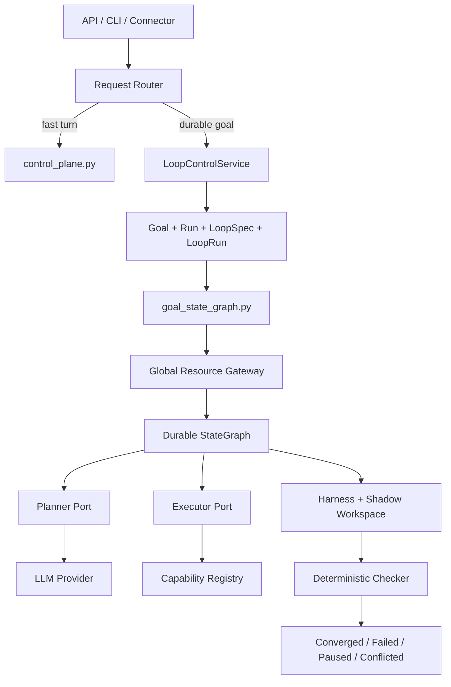

# Navi 2.0 Architecture

Navi 2.0 is organized around a control plane and a durable loop plane. The
control plane handles one-turn conversational work. Durable goals are converted
into `GoalSpec` and `LoopSpec` records and then executed by the StateGraph with
explicit planner and executor ports.

## Layers

1. Presentation and ingress

- `api.py` and API routers expose local HTTP control surfaces.
- `cli.py` and CLI command modules expose local operator workflows.
- Connectors such as Weixin and Telegram normalize external messages into the
  same control-plane entrypoints.

2. Request and resource control

- `request_router.py` decides whether a request is a fast one-turn turn or a
  slow durable goal.
- `resource_gateway.py` enforces budget, concurrency, and escalation decisions.
- `vault.py` owns secret lookup and keeps secret values out of prompt, memory,
  and trace surfaces.

3. Fast path control plane

- `control_plane.py` owns bounded single-turn orchestration.
- `turn_lifecycle.py` owns turn setup, trace, memory, and finalization phases.
- `turn_result.py` defines the turn result contract.
- `runtime.py`, `syscalls.py`, `prompt_os.py`, and `prompting.py` provide
  provider-mediated planner and responder calls.

4. Slow path loop plane

- `loop_control_service.py` creates and resumes Goals, Runs, LoopSpecs, and
  LoopRuns. It does not execute the graph.
- `goal_state_graph.py` bridges prepared Goal/LoopRun records into the durable
  StateGraph.
- `state_graph.py` executes `PLAN -> EXECUTE -> EVALUATE` through explicit
  `planner_port` and `executor_port` implementations. The synchronous
  deterministic runner is disabled.
- `checker.py` evaluates objective verification evidence.

5. Harness and workspace isolation

- `harness.py` runs commands with bounded timeout and returns objective facts.
- `workspaces.py` owns shadow workspaces, locks, and merge-back behavior.
- `loop_runs.py` persists checkpoints, events, and current StateGraph state.

6. Capabilities, governance, and stores

- `capabilities.py`, `capabilities_types.py`, and `actions/*` define declared
  tool contracts, permission ceilings, and capability execution.
- `goals.py`, `runs.py`, `subagents.py`, `trace.py`, `memory`, and `evolution.py`
  persist durable state and audit data.

## Control Flow

## Non-Negotiable Boundaries

- There is no production deterministic StateGraph runner.
- The control plane cannot self-certify durable goal completion.
- `LoopControlService` prepares control facts; StateGraph execution happens only
  through explicit runtime-backed ports.
- Shadow workspace changes merge back only after objective checker evidence.
- Trace is audit evidence, while the active StateGraph state lives in
  materialized LoopRun records.
