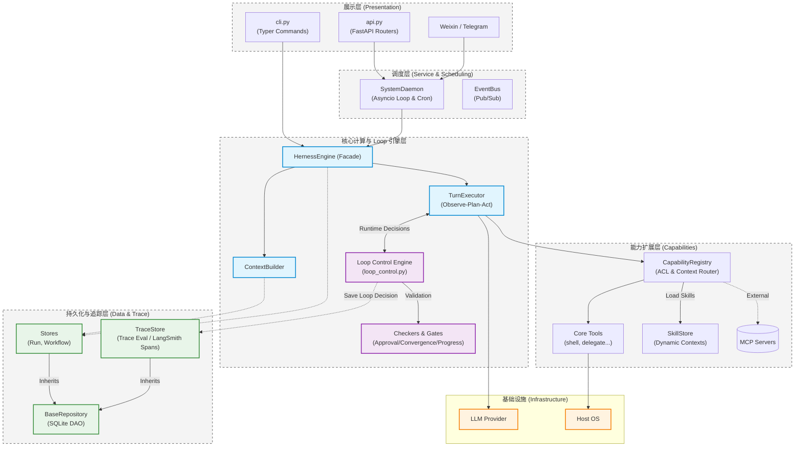

# Navi 核心架构梳理 (重构后版本)

经过前两阶段的深度重构与治理，Navi 目前已经演进为一个分层清晰、职责明确的现代化智能体框架。整体架构从上到下可以划分为五大核心层，外加底层基础设施的支持。

## 架构分层解析

1. **展示与接入层 (Presentation Layer)**
   * **`api.py` (包含 `api/routers/`)**: 提供对外的 RESTful 接口支持，剥离了以前堆砌在一起的路由，现在仅作为 FastAPI 的组装中心。
   * **`cli.py` (包含 `cli/commands/`)**: 基于 Typer 的命令行入口，各类 `trace`、`memory` 命令已被拆分。
   * **Connectors (连接器)**: 包含 Telegram, Weixin 等外部消息来源接入点。

2. **调度与服务层 (Service & Scheduling)**
   * **`SystemDaemon`**: 系统的核心后台“心脏”。运行在异步事件循环中，负责监听端口事件、拉取队列、触发定时任务 (`cron.py`)。
   * **`EventBus`**: 内部的发布订阅总线。比如审批通过（`ApprovalResolved`）时，通过事件总线非阻塞地唤醒被挂起的 Agent 任务。

3. **核心计算引擎与 Loop 层 (Core Engine & Loop Control)**
   原本的上帝类已被肢解，现在严格遵循《Loop Engineering》文章中的 Runtime Contract 规范：
   * **`HernessEngine`**: 降级为外部调用的总控外观（Facade）。
   * **`ContextBuilder`**: 负责在每轮对话前计算 Token 预算，组装 Prompt。
   * **`TurnExecutor` (Observe-Plan-Act)**: 负责实际的单步推导与执行。
   * **`LoopControl` & Checkers/Gates (Loop 引擎)**: **独立的第一等公民！** 它不通过 Prompt 规则控制模型，而是通过代码中硬编码的 Gates（进度校验、死循环检测 `loop_no_progress`、审批拦截）和 Checkers（最终结果验证）。每次循环都会严格产出明确的 `LoopDecision`（如 `continue`, `recover`, `blocked`, `failed`）。

4. **能力拓展与工具层 (Capabilities, Skills & MCP)**
   * **`CapabilityRegistry`**: 工具路由器与安全守门员（ACL 校验、Schema 校验）。**它也是原生 MCP (Model Context Protocol) 客户端的主入口**，负责挂载和路由外部 MCP Servers 提供的工具。
   * **`Tools`**: 原子的系统调用（如 `shell.run`, `delegate.reply`）。
   * **`SkillStore`**: 动态技能库。注册于 Registry 之下，提供大模型后天的领域知识拓展（如 `skills.view`）。

5. **持久化与追踪层 (DAO, Persistence & Trace)**
   * **`BaseRepository`**: 全新的数据库基类（DAO 模式）。
   * **`TraceStore`**: 核心监控模块。与 Loop 引擎深度绑定，负责记录结构化的 `trace_events` 和 `loop_decisions`（而非单纯看抛错），支持基于 LangSmith Span/Run 模型的轨迹分析。
   * **周边 Stores**: `RunStore`, `WorkflowStore`, `GoalStore`。

---

## 架构拓扑图 (包含 Loop 引擎与拓展生态)

以下是采用 Mermaid 绘制的架构数据流与层级依赖拓扑图：

### 架构演进说明

相较于重构前，此架构图体现了几个关键的改变：
1. **Loop 引擎独立化 (Runtime Contract)**：彻底贯彻了 `loop-engineering.md` 的指导思想，Loop 控制不再是散落在代码里的字符串检查，而是由独立的 `LoopControl` 产生明确的 `continue/recover/blocked/failed` 决策。
2. **单一入口点**：所有的用户输入流（API、CLI、IM）都会汇聚到 `HernessEngine`，消除了原本在连接器层的正则硬编码拦截。
3. **隔离的存储访问**：组件不再直接手写 `sqlite3.connect()`，全部经由 DAO 层路由。
4. **统一的能力网关**：无论是内置原生 Tool，还是外置的 `MCP` 协议服务器，亦或是用于增强背景知识的 `Skill`，均统一挂载在 `CapabilityRegistry` 下集中管理安全边界。
