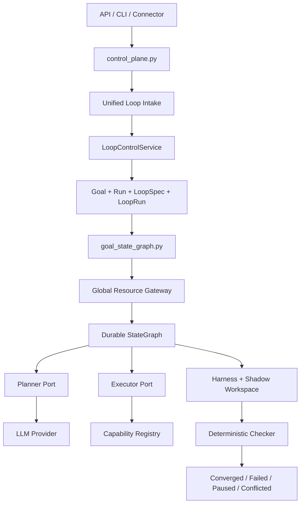

# Loop Engineering

Loop engineering in Navi means the observe-plan-act loop has explicit runtime
decisions, checkers, gates, and trace evaluation. It is not a prompt rule that
tells the model how to behave.

## Runtime Contract

Every meaningful loop edge records a `loop.decision` trace event before the
trace is evaluated.

Required decision shapes:

- `continue`: capability result facts were recorded and the loop remains
  eligible for another planner step from the updated runtime context.
- `recover`: a completion checker blocked a terminal answer and recovery facts
  were exposed as loop-gate facts.
- `pause_for_approval`: the current facts require approval or an existing
  approval is already pending.
- `converged`: the runtime detected repeated stable progress after a soft
  no-progress gate fact was already exposed and is stopping the loop as a
  last-resort budget/safety boundary.
- `finalize`: terminal facts or completion evidence are sufficient to answer.
- `blocked`: a checker or gate prevents the loop from completing.
- `failed`: planner, provider, parser, safeguard, capability, or workflow-step
  failure ended the loop.

Each decision may include:

- `checker_results`: fact-level completion checks such as completion evidence,
  workflow-step evidence, terminal result validity, or capability result status.
- `gate_results`: runtime gates such as approval wait, soft no-progress facts,
  and last-resort no-progress convergence.
- `failure_domain`: structured trace/eval domain such as `planner_or_parser`,
  `capability_failure`, `checker_blocked`, `approval_loop`, or `none`.
- `progress_signature`: the stable signature used for no-progress detection.
- `workflow_id`, `step_id`, and `goal_ids` when the loop is part of durable
  workflow or goal execution.

## Trace Evaluation

`trace.evaluate` must prefer loop decisions over raw first-failed-event
heuristics. The current loop-level failure domains are:

- `planner_or_parser`
- `provider_no_response`
- `capability_failure`
- `safeguard_policy`
- `checker_blocked`
- `missing_completion_check`
- `approval_loop`
- `loop_no_progress`
- `runtime`
- `trace_missing`

Raw events such as `planner.syscall`, `capability.result`,
`loop.check`, `loop.recovery`, `runtime.converged`, and `turn.final`
remain as evidence. They are not the primary diagnosis when a loop decision is
available.

Inspection surfaces:

- `navi trace show TRACE_ID` includes inline loop-decision summaries.
- `navi trace decisions TRACE_ID` lists only loop decisions.
- `navi trace runs TRACE_ID` lists a LangSmith-style run/span projection.
- `GET /v1/traces/{trace_id}` returns both raw `events` and `loop_decisions`.
- `GET /v1/traces/{trace_id}/decisions` returns only loop decisions.
- `GET /v1/traces/{trace_id}/runs` returns only run/span projections.

## LangSmith-Style Alignment

Navi traces should move toward a run/span model: a root trace run plus child
runs for planner calls, capability calls, loop checks, recovery, workflow
steps, and final responses. Each projected run exposes `name`, `run_type`,
`status`, `thread_id`, `inputs`, `outputs`, `tags`, `metadata`, and
`feedback`.

The current implementation derives this view from `trace_events`, which remain
the single trace source of truth. The root run uses the `trace_id`; child runs
point to it through `parent_run_id`. `session_id` is exposed as `thread_id`,
which gives trace consumers a LangSmith-style thread grouping without making
the runtime infer the agent's next step.

Remaining parity gaps are explicit product work: durable feedback capture,
dataset links, and export/import interoperability.

## Prohibited Surfaces

Navi must not control loop behavior through:

- Planner prompt rules for a specific approval state.
- Hardcoded `respond` fallback text.
- Visible step-budget or budget-exhausted semantics.
- First-repeat no-progress hard termination; the first repeated progress
  signature must be exposed as structured runtime facts so the planner can
  choose the next declared syscall.
- Aliases for obsolete trace failure-domain names.
- JSON extraction from markdown fences, surrounding prose, or provider
  reasoning text for model-owned protocols.

Machine vocabulary for phases, decision kinds, checker names, and failure
domains must live in `src/navi/loop.py`, not as scattered string checks in
runtime code.

Trace evaluation must read structured JSON fields such as `failure_domain`,
`checker_results`, and `gate_results`. It must not infer domains from natural
language `reason` text or token matching.

If the model repeats a `goal.open` while the approval is already pending,
the runtime records `pause_for_approval` with an `approval_gate` result and the
trace can evaluate to `approval_loop`. The fix belongs in state, trace, and gate
semantics, not in a prompt warning.

## Layers

1. Presentation and ingress

- `api.py` and API routers expose local HTTP control surfaces.
- `cli.py` and CLI command modules expose local operator workflows.
- Connectors such as Weixin and Telegram normalize external messages into the
  same control-plane entrypoints.

2. Request and resource control

- `request_router.py` validates model-owned intent facts for the unified loop
  intake. It chooses a request intent, not an execution path.
- `resource_gateway.py` enforces budget, concurrency, and escalation decisions.
- `vault.py` owns secret lookup and keeps secret values out of prompt, memory,
  and trace surfaces.

3. Unified loop control plane

- `control_plane.py` owns inbound turn setup and hands every request to the
  unified loop kernel.
- `turn_lifecycle.py` owns turn setup, trace, memory, and finalization phases.
- `turn_result.py` defines the turn result contract.
- `runtime.py`, `syscalls.py`, `prompt_os.py`, and `prompting.py` provide
  provider-mediated planner and responder calls.

4. Durable loop plane

- `loop_control_service.py` creates and resumes Goals, Runs, LoopSpecs, and
  LoopRuns. It records `loop_kind` so not every loop is treated as a user-facing
  durable goal. It does not execute the graph.
- `goal_state_graph.py` bridges prepared Goal/LoopRun records into the durable
  StateGraph.
- `state_graph.py` executes `PLAN -> EXECUTE -> EVALUATE` through explicit
  `planner_port` and `executor_port` implementations. The synchronous
  deterministic runner is disabled.
- `checker.py` evaluates objective verification evidence.

5. Harness and workspace isolation

- `harness.py` runs commands with bounded timeout and returns objective facts.
- `workspaces.py` owns shadow workspaces, locks, and merge-back behavior.
- `loop_runs.py` persists checkpoints, events, and current StateGraph state.

6. Capabilities, governance, and stores

- `capabilities.py`, `capabilities_types.py`, and `actions/*` define declared
  tool contracts, permission ceilings, and capability execution.
- `goals.py`, `runs.py`, `subagents.py`, `trace.py`, `memory`, and `evolution.py`
  persist durable state and audit data.

## Control Flow

## Non-Negotiable Boundaries

- There is no production deterministic StateGraph runner.
- The control plane cannot self-certify durable goal completion.
- `LoopControlService` prepares control facts; StateGraph execution happens only
  through explicit runtime-backed ports.
- Shadow workspace changes merge back only after objective checker evidence.
- Trace is audit evidence, while the active StateGraph state lives in
  materialized LoopRun records.

## Component Responsibilities

| Component | File | Responsibility |
|---|---|---|
| Loop intake validator | `request_router.py` | Validates model-owned intent facts for unified loop intake. |
| Control plane | `control_plane.py` | Normalizes ingress, injects current state, and starts/resumes unified loops. |
| Loop control service | `loop_control_service.py` | Creates, resumes, cancels, and reads durable Goal/LoopRun state. |
| Goal graph bridge | `goal_state_graph.py` | Runs a prepared LoopRun through runtime-backed StateGraph ports. |
| Durable StateGraph | `state_graph.py` | Executes `PLAN -> EXECUTE -> EVALUATE` through explicit ports. |
| Resource gateway | `resource_gateway.py` | Enforces budget, rate, concurrency, pause, and escalation gates. |
| Harness | `harness.py` | Runs objective commands with timeout and returns facts. |
| Workspace layer | `workspaces.py` | Owns shadow workspace creation, locks, conflict detection, and merge-back. |
| Checker | `checker.py` | Accepts or rejects objective evidence. |
| Loop run store | `loop_runs.py` | Persists checkpoints, transitions, and events. |

## StateGraph Contract

`DurableStateGraphRunner.run()` is disabled. Production execution must call
`run_async()` with both:

- `planner_port`: the model-backed planner adapter.
- `executor_port`: the capability execution adapter.

If either port is missing, the graph fails immediately instead of falling back
to deterministic placeholder behavior.

## Terminal States

- `CONVERGED`: checker accepted objective evidence and merge-back, if any,
  completed cleanly.
- `FAILED`: planner, executor, or checker rejected the run.
- `BLOCKED`: a checker or gate cannot proceed without a new route.
- `TIMED_OUT`: harness or checker hit a hard timeout.
- `PAUSED`: resource limits, locks, or user control paused execution.
- `WAITING_APPROVAL`: execution requires explicit approval.
- `CONFLICTED`: shadow merge detected a human/agent conflict.
