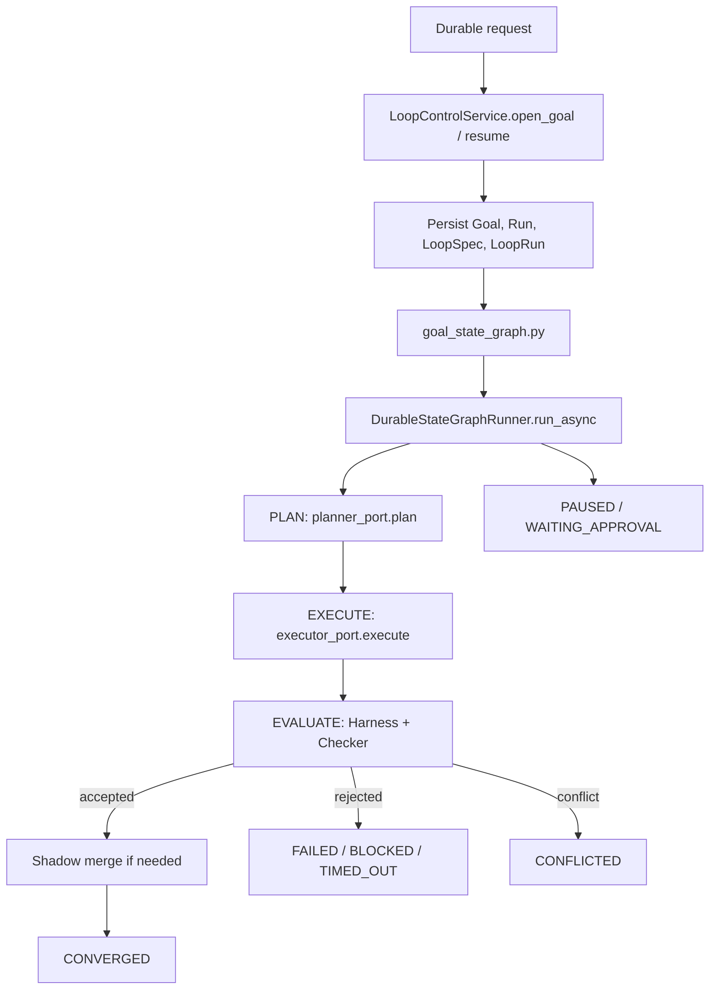

# Navi 2.0 Loop Execution Flow

Navi 2.0 has two execution paths:

- Fast path: bounded one-turn orchestration in `control_plane.py`.
- Slow path: durable goal execution through `GoalSpec`, `LoopSpec`, and
  `DurableStateGraphRunner.run_async()`.

The old synchronous deterministic loop body is not part of the runtime
contract.

## Slow Path

## Component Responsibilities

| Component | File | Responsibility |
|---|---|---|
| Request router | `request_router.py` | Chooses fast turn vs durable goal. |
| Control plane | `control_plane.py` | Runs bounded one-turn planner/capability/responder flow. |
| Loop control service | `loop_control_service.py` | Creates, resumes, cancels, and reads durable Goal/LoopRun state. |
| Goal graph bridge | `goal_state_graph.py` | Runs a prepared LoopRun through runtime-backed StateGraph ports. |
| Durable StateGraph | `state_graph.py` | Executes `PLAN -> EXECUTE -> EVALUATE` through explicit ports. |
| Resource gateway | `resource_gateway.py` | Enforces budget, rate, concurrency, pause, and escalation gates. |
| Harness | `harness.py` | Runs objective commands with timeout and returns facts. |
| Workspace layer | `workspaces.py` | Owns shadow workspace creation, locks, conflict detection, and merge-back. |
| Checker | `checker.py` | Accepts or rejects objective evidence. |
| Loop run store | `loop_runs.py` | Persists checkpoints, transitions, and events. |

## StateGraph Contract

`DurableStateGraphRunner.run()` is disabled. Production execution must call
`run_async()` with both:

- `planner_port`: the model-backed planner adapter.
- `executor_port`: the capability execution adapter.

If either port is missing, the graph fails immediately instead of falling back
to deterministic placeholder behavior.

## Terminal States

- `CONVERGED`: checker accepted objective evidence and merge-back, if any,
  completed cleanly.
- `FAILED`: planner, executor, or checker rejected the run.
- `BLOCKED`: a checker or gate cannot proceed without a new route.
- `TIMED_OUT`: harness or checker hit a hard timeout.
- `PAUSED`: resource limits, locks, or user control paused execution.
- `WAITING_APPROVAL`: execution requires explicit approval.
- `CONFLICTED`: shadow merge detected a human/agent conflict.
