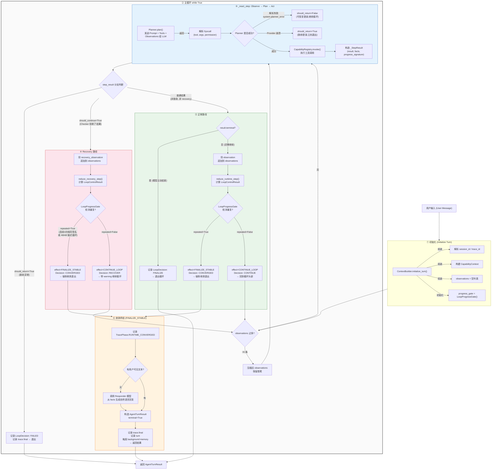
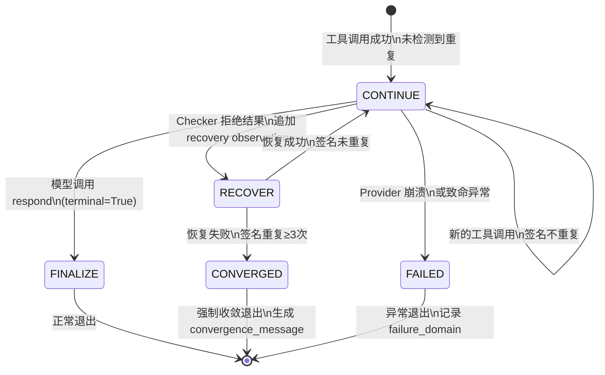

# Navi Loop 执行流程详解

本文档详细描述了 Navi 当前 Loop 的完整执行机制，严格对应 `loop-engineering.md` 中定义的 Runtime Contract。

## 核心原则

> Loop 控制是**代码级别的运行时决策 (Runtime Decision)**，而非 Prompt 规则。
> 模型不知道 Loop 的存在，它只知道"被调用、返回结果"。

---

## Loop 执行流程图

---

## 关键组件职责对照表

| 组件 | 文件 | 职责 |
|---|---|---|
| **TurnExecutor.handle_loop()** | `core/turn_executor.py:477` | 外层 `while True` 驱动器。负责调度 `_react_step` 并根据返回值走不同分支。 |
| **TurnExecutor._react_step()** | `core/turn_executor.py:223` | 单步执行器。调用 Planner → 解析 Syscall → 调用 Capability → 返回 `_StepResult`。 |
| **reduce_runtime_step()** | `loop_control.py:153` | **正常路径的 Loop 裁判**。接收每步的 facts 和 progress_signature，产出 `CONTINUE_LOOP` 或 `FINALIZE_STABLE`。 |
| **reduce_recovery_step()** | `loop_control.py:58` | **恢复路径的 Loop 裁判**。当 Checker 拒绝了模型的结果后，判断是继续恢复还是强制收敛。 |
| **LoopProgressGate.observe()** | `loop.py:240` | **死循环检测器 (No-Progress Gate)**。维护签名历史，通过三种策略检测重复：① 同一工具连续3次相同签名 ② ABAB 链式循环 ③ 全局签名出现≥5次。 |
| **LoopDecision** | `loop.py:129` | **结构化决策记录**。每次循环边沿都会产出一条包含 `decision`、`reason`、`failure_domain`、`checker_results`、`gate_results` 的完整决策，持久化到 TraceStore。 |

---

## Loop Decision 状态机

---

## 与 loop-engineering.md 的对应关系

| 文章中的概念 | 代码中的实现 |
|---|---|
| `continue` decision | `LoopDecisionKind.CONTINUE` → `reduce_runtime_step` 返回 `CONTINUE_LOOP` |
| `recover` decision | `LoopDecisionKind.RECOVER` → `reduce_recovery_step` 中 Checker 拒绝后的恢复分支 |
| `converged` decision | `LoopDecisionKind.CONVERGED` → `LoopProgressGate` 检测到 `repeated=True` |
| `finalize` decision | `LoopDecisionKind.FINALIZE` → 模型主动调用 `respond` 等终止工具 |
| `blocked` decision | `LoopDecisionKind.BLOCKED` → 审批等待或门禁拦截 |
| `failed` decision | `LoopDecisionKind.FAILED` → Provider 崩溃、引擎异常 |
| `checker_results` | `LoopCheckResult` 数组，包含 `completion_checker`、`capability_result` 等 |
| `gate_results` | `LoopCheckResult` 数组，包含 `no_progress_gate` 等 |
| `progress_signature` | `semantic_progress_signature()` 生成，由 `LoopProgressGate.observe()` 消费 |
| `failure_domain` | `TraceFailureDomain` 枚举：`planner_or_parser`、`capability_failure`、`loop_no_progress` 等 |
| Trace evaluation 优先 loop decisions | `TraceStore` 的 `evaluate` 方法优先读取 `loop_decisions`，而非直接看 raw events |
